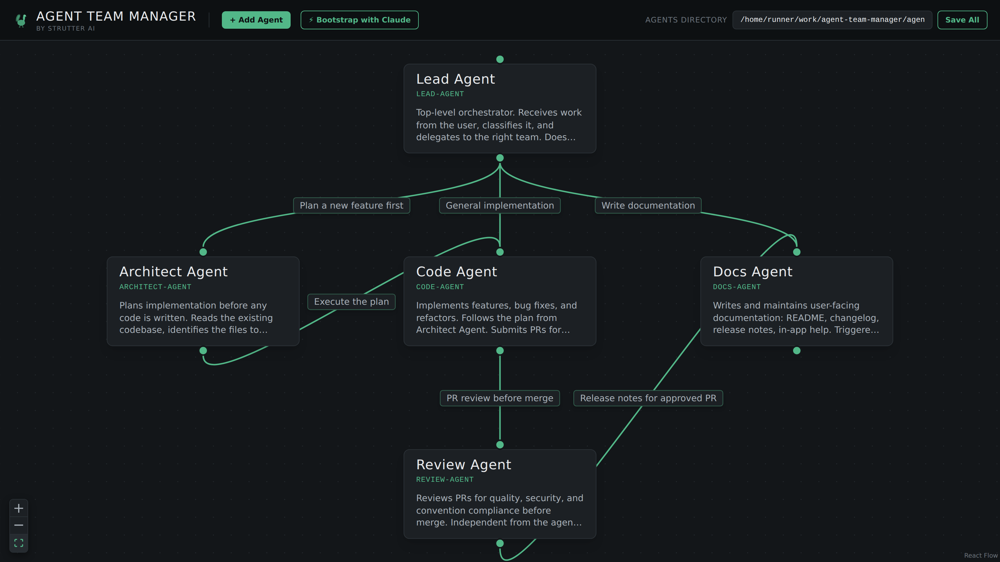
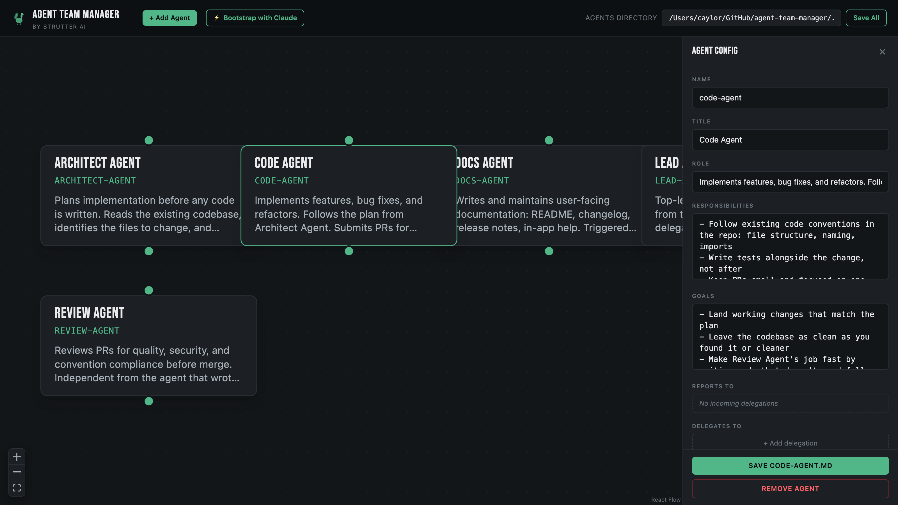

# Agent Team Manager

> Visual org chart designer for [Claude Code](https://claude.com/claude-code) agent teams. Built by [Strutter AI](https://strutterai.com).

Edit your agents as cards. Draw delegation lines as edges. The tool writes everything back to `.claude/agents/*.md` so Claude reads the org chart at session start and knows who delegates to whom.



Click any agent to edit Name, Title, Role, Responsibilities, Goals, and who they delegate to.



## What it does

- **Visual canvas** — every agent is a card. Drag to rearrange. Click to edit Name, Title, Role, Responsibilities, Goals.
- **Draw delegation lines** — connect any two agents and label the relationship. Lines auto-save to each agent's `## Delegation` section so Claude reads them.
- **Live filesystem** — the tool reads and writes `.claude/agents/*.md` directly. There's no separate database. Edit a file in your editor, reload the canvas, your change shows up.
- **Bootstrap with Claude** — first time using it? Click "⚡ Bootstrap with Claude" in the toolbar to get a ready-to-paste prompt that has Claude design and write your initial team.

## Quick start

Requires Node 20+.

```bash
git clone https://github.com/strutterai/agent-team-manager.git
cd agent-team-manager
npm install
npm run dev
```

Then open http://localhost:5173 in your browser.

On first load, the tool reads from the demo `.claude/agents/` folder shipped with this repo so you have something to play with. To point it at your own project, type the path to your project's `.claude` folder in the "Agents directory" field at the top right.

## How it works

```
                  ┌──────────────┐
   Your edits ───►│   Canvas     │
                  │ (React Flow) │
                  └──────┬───────┘
                         │
                  ┌──────▼───────┐
                  │ Express API  │
                  │   :3001      │
                  └──┬────────┬──┘
                     │        │
            ┌────────▼─┐  ┌───▼───────────────────┐
            │org-chart │  │ .claude/agents/*.md   │
            │  .json   │  │ Role, Resp, Goals,    │
            │positions │  │ ## Delegation         │
            │+ edges   │  │                       │
            └──────────┘  └───────────────────────┘
```

Canvas state (positions, which edges exist) lives in `org-chart.json` per-user. Actual agent content lives in `.claude/agents/*.md` — the same files Claude Code reads at session start. When you draw or edit a delegation edge, the tool surgically updates only the `## Delegation` section of the affected agent files, preserving everything else.

## Use with Claude Code

1. Point Agent Team Manager at your project's `.claude` folder.
2. Design your team visually: add agents, drag delegation lines, write reasons.
3. Open Claude Code in the same project. Claude reads `.claude/agents/*.md` at session start and sees the delegation graph you built.
4. When Claude delegates work, it follows the "Delegates to" lines you drew. Reviewers see who reports to them via the "Reports to" lines.

The org chart literally programs how Claude routes work across specialists.

## Tech stack

- **Frontend**: React 19, TypeScript, Vite, Tailwind CSS, [React Flow](https://reactflow.dev/), Zustand
- **Backend**: Express (one small server for filesystem reads/writes)
- **Format**: Plain markdown — your agent files stay readable, diffable, and editable outside the tool

## Contributing

See [CONTRIBUTING.md](CONTRIBUTING.md). Issues and PRs welcome.

## License

[MIT](LICENSE) — use it, fork it, ship it.

---

Built by [Strutter AI](https://strutterai.com) 🦃 — the only RFP platform built for both issuers and responders.
